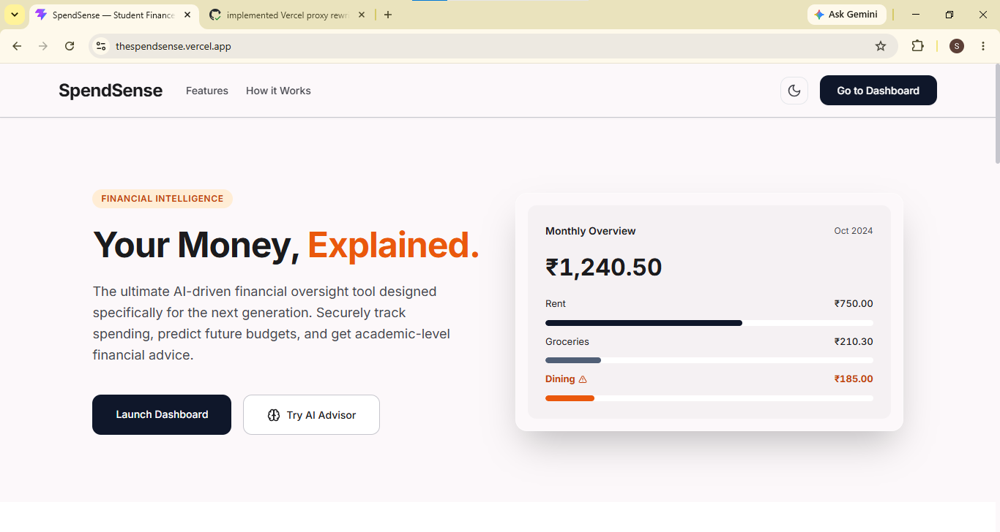
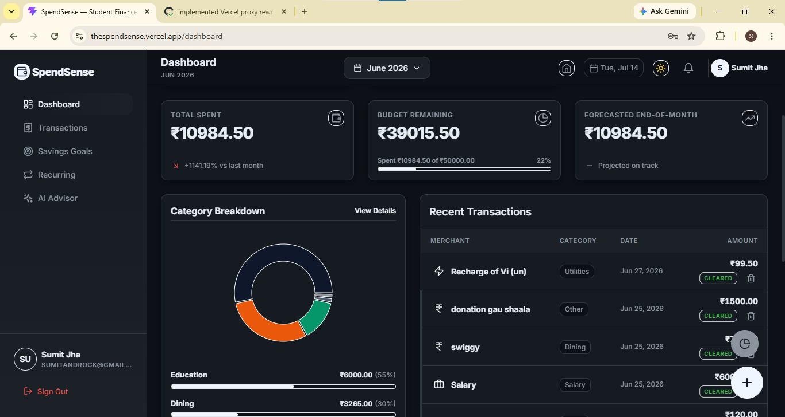
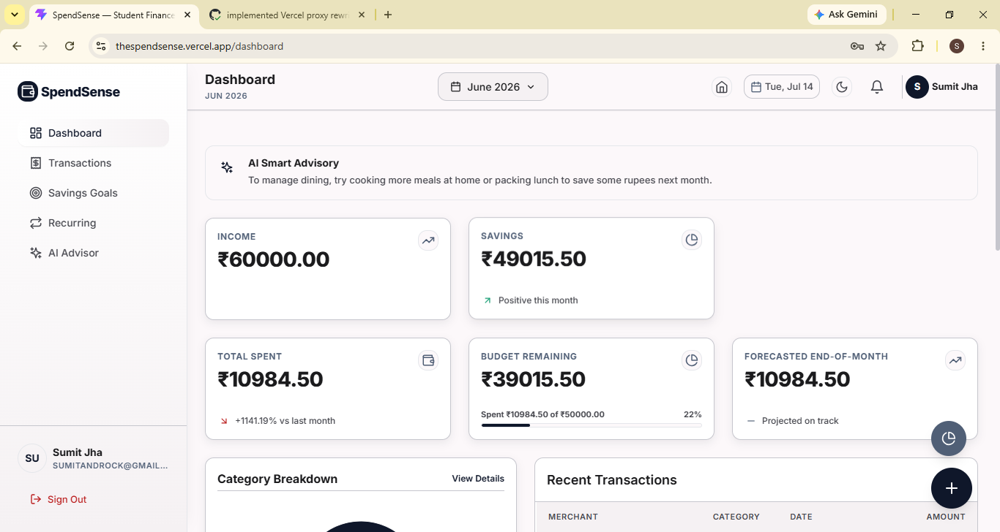
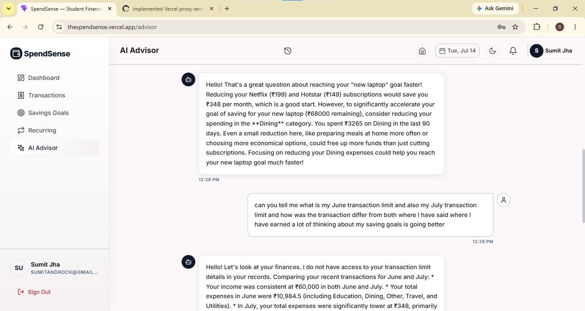
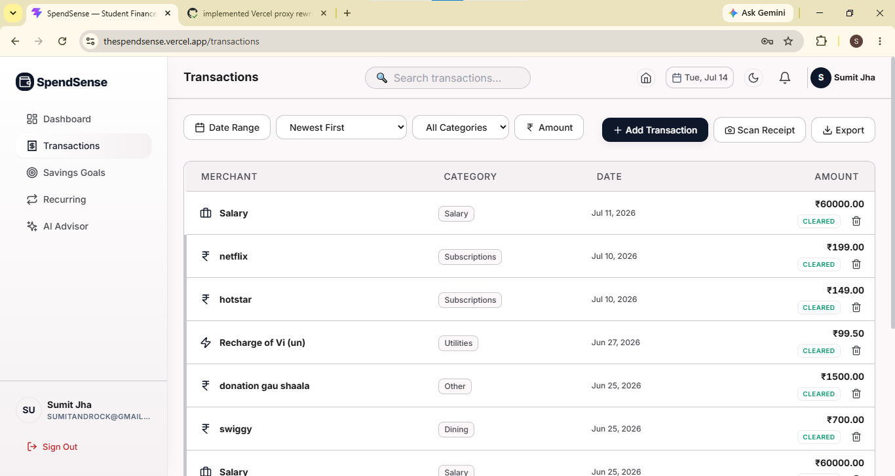
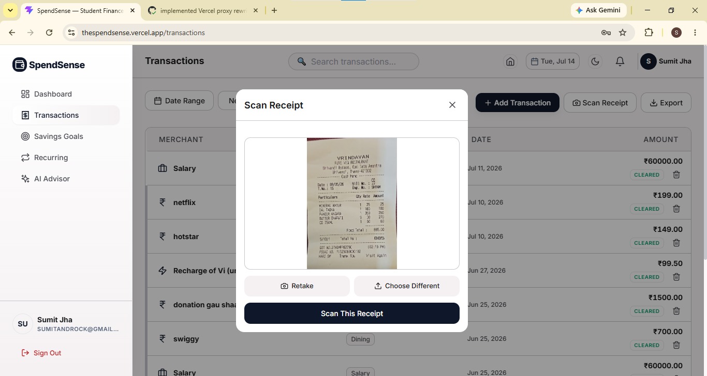
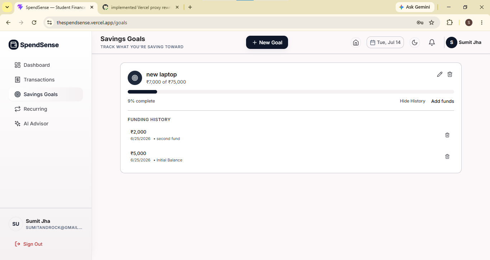
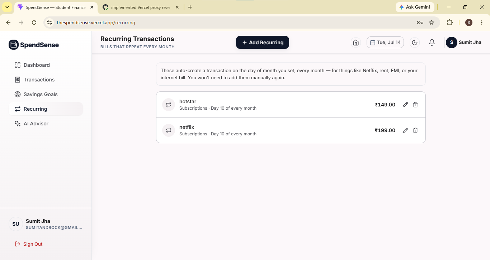
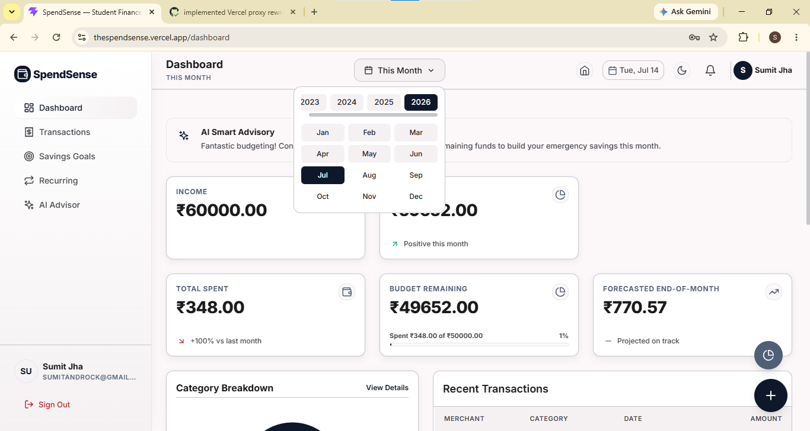

<div align="center">

# SpendSense
### AI-Powered Personal Finance Tracker for Students

[](https://thespendsense.vercel.app)
[](https://github.com/sumit0721/Spendsense)

**SpendSense doesn't just log your spending — it explains it.**

</div>

---

## 📸 Screenshots

<div align="center">

### 🏠 Landing Page


### 📊 Dashboard


### 🤖 AI Smart Advisory


### 💬 AI Advisor Chat


### 💳 Transactions


### 🧾 Receipt Scanner


### 🎯 Savings Goals


### 🔁 Recurring Transactions


### 📅 Month Selector



</div>

---

## ✨ Features

### 🤖 AI Features — 3 Distinct, All Grounded in Real User Data

**1. Context-Grounded Financial Advisor**
Pulls the user's last 90 days of transactions, aggregates category totals, top merchants, and month-over-month deltas, injects that structured data into a Gemini prompt, and answers only from what's in the injected context. Explicit hallucination guardrails prevent generic financial advice. Advisory sentences are cached per user per month (6-hour TTL) to prevent repeated API calls on every dashboard load.

**2. Statistical Anomaly Detection**
Computes per-user, per-category mean and standard deviation from transaction history. Any new transaction falling outside 2 standard deviations from that user's own baseline is flagged — not a hardcoded threshold. Categories with fewer than 5 data points skip flagging to prevent false positives. Flagged transactions appear in the notification panel and transaction list.

**3. Deterministic Budget Forecaster with AI Translation**
All math is deterministic code: spend velocity (daily average) × days remaining = projected month-end total. Gemini's only job is translating that pre-computed number into one plain-language sentence. Financial math never lives inside the LLM call — forecasts are verifiable, reproducible, and fast.

---

### 💰 Finance Management
- Income + Expense tracking with separate category lists per type
- Payment method tracking — UPI, Cash, Debit Card, Credit Card, Net Banking
- Monthly budget planning with per-category limits and breach alerts
- Dashboard summary cards — Income, Expense, Savings for the selected month
- Month/Year selector — all dashboard sections update together for any past month

### 📊 Analytics & Charts
- Category breakdown pie chart (Recharts)
- Monthly expense trend — last 6 months bar chart
- Month-over-month comparison with percentage delta
- Per-category progress bars showing spend vs budget limit

### 🧾 Receipt Scanner (OCR)
- Upload a photo of any receipt — physical bills or UPI payment screenshots (Paytm, GPay, PhonePe)
- Tesseract.js extracts text; regex parsing pulls amount, date, and merchant
- Handles both document layouts: physical receipts (store name first) and payment apps (labeled "For:", "Paid to:" fields)
- Mandatory user review screen before anything saves — OCR guesses are pre-filled but user must confirm
- Images stored privately in AWS S3 under per-user namespaced paths

### 🎯 Savings Goals
- Create goals with name, target amount, and optional target date
- Add funds incrementally with progress bar and percentage complete
- Goal auto-marks complete when saved amount reaches target
- Edit goal details after creation

### 🔁 Recurring Transactions
- Set up monthly bills once — Netflix, Rent, EMI, internet
- Cron job runs daily at midnight, auto-creates transactions on the configured day-of-month
- Source field set to `recurring` for audit trail

### 📤 Export
- **CSV** — client-side, instant download
- **PDF** — server-generated, formatted table with alternating row shading and page-break handling
- **Excel** — server-generated via ExcelJS with structured columns

### 🔐 Authentication
- JWT in httpOnly cookies (not localStorage)
- Refresh token rotation with reuse detection
- Forgot password via email OTP (Nodemailer)

---

## 🏗️ Architecture

```
Browser (HTTPS)
    │
    ▼
Vercel Edge Network
    │  React/Vite frontend (static, global CDN)
    │  vercel.json rewrites /api/* → EC2 (proxy)
    ▼
AWS EC2 t2.micro
    │  Docker container (Node.js/Express)
    │  Proxy auth middleware (shared secret)
    │  Rate limiting, Helmet security headers
    ▼
MongoDB Atlas (cloud-managed database)

AWS S3 — Private bucket, per-user receipt image storage
GitHub Actions — CI/CD on every push to main
```

---

## 🛠️ Tech Stack

| Layer | Technology |
|-------|-----------|
| Frontend | React 19, Vite, Tailwind CSS, Recharts, Lucide Icons, Axios |
| Backend | Node.js, Express.js, Mongoose, JWT, bcrypt, Helmet, express-rate-limit |
| Database | MongoDB Atlas |
| AI | Google Gemini API (5-model cascade with fallback), Tesseract.js OCR |
| Cloud | AWS EC2 (t2.micro), AWS S3 |
| DevOps | Docker (multi-stage build, non-root user), GitHub Actions CI/CD |
| Email | Nodemailer (OTP password reset) |
| Export | PDFKit, ExcelJS, native CSV |

---

## 🚀 Getting Started

### Prerequisites
- Node.js v20+
- MongoDB (local or Atlas URI)
- Google Gemini API key
- AWS account with S3 bucket (for receipt scanning)

### Backend Setup

```bash
cd backend
npm install
```

Create `backend/.env`:
```env
PORT=5000
MONGO_URI=your_mongodb_uri
JWT_SECRET=your_jwt_secret
JWT_REFRESH_SECRET=your_refresh_secret
GEMINI_API_KEY=your_gemini_api_key
CLIENT_URL=http://localhost:5173
NODE_ENV=development
AWS_ACCESS_KEY_ID=your_aws_key
AWS_SECRET_ACCESS_KEY=your_aws_secret
AWS_REGION=ap-south-1
AWS_S3_BUCKET_NAME=your_bucket_name
EMAIL_USER=your_gmail@gmail.com
EMAIL_PASS=your_gmail_app_password
```

```bash
npm run dev
```

### Database Migration (first run only, if you have existing data)

```bash
node migrate.js
```

### Frontend Setup

```bash
cd frontend
npm install
npm run dev
```

Open `http://localhost:5173`

### Docker

```bash
docker compose up --build
```

---

## 📁 Project Structure

```
spendsense/
├── .github/workflows/deploy.yml
├── docs/
│   └── screenshots/               
├── backend/
│   ├── migrate.js
│   ├── Dockerfile
│   └── src/
│       ├── controllers/
│       │   ├── aiAdvisorController.js
│       │   ├── authController.js
│       │   ├── budgetController.js
│       │   ├── exportController.js
│       │   ├── receiptController.js
│       │   ├── recurringController.js
│       │   ├── savingsGoalController.js
│       │   └── transactionController.js
│       ├── middleware/
│       │   ├── auth.js
│       │   ├── errorHandler.js
│       │   └── proxyAuth.js
│       ├── models/
│       │   ├── Budget.js
│       │   ├── Chat.js
│       │   ├── RecurringTransaction.js
│       │   ├── SavingsGoal.js
│       │   ├── Transaction.js
│       │   └── User.js
│       ├── routes/
│       └── utils/
│           ├── email.js
│           ├── geminiClient.js
│           ├── recurringScheduler.js
│           └── s3Client.js
├── docker-compose.yml
└── frontend/
    ├── vercel.json
    └── src/
        ├── components/
        ├── context/
        ├── pages/
        └── services/api.js
```

---

## 🔑 API Endpoints

| Method | Endpoint | Description |
|--------|----------|-------------|
| POST | `/api/auth/register` | Register |
| POST | `/api/auth/login` | Login, httpOnly cookie |
| POST | `/api/auth/refresh-token` | Rotate refresh token |
| GET | `/api/transactions` | List with filters |
| POST | `/api/transactions` | Create (income or expense) |
| DELETE | `/api/transactions/:id` | Delete |
| GET | `/api/transactions/summary` | Income/expense/savings |
| GET | `/api/transactions/stats` | Category totals, MoM |
| GET | `/api/transactions/trend` | Monthly trend data |
| GET | `/api/transactions/export/pdf` | PDF download |
| GET | `/api/transactions/export/excel` | Excel download |
| GET | `/api/budgets/forecast` | Forecast + AI advisory |
| POST | `/api/advisor/ask` | Ask AI advisor |
| GET/POST | `/api/goals` | Savings goals |
| PATCH | `/api/goals/:id/progress` | Add funds |
| GET/POST | `/api/recurring` | Recurring transactions |
| POST | `/api/receipt/scan` | OCR receipt scan |

---

## 🧠 AI Engineering Decisions

**Structured context injection over RAG:** Transaction history at this scale fits entirely in one prompt context window. A full vector-embedding RAG pipeline adds complexity with no accuracy benefit at this data size.

**Deterministic math for forecasting:** If the LLM did the arithmetic, numbers would be non-reproducible. Math in code = testable and verifiable. LLM involvement limited to phrasing only.

**Z-score over fixed threshold for anomalies:** A fixed threshold flags rent as suspicious every month. Per-user, per-category baseline means "unusual" is relative to that person's actual pattern.

**5-model cascade:**
```
gemini-2.5-flash → gemini-3.5-flash → gemini-3-flash → gemini-2.5-flash-lite → gemini-3.1-flash-lite
```
429/503/404 errors cascade to the next model. Non-retriable errors (400, 403) fail immediately.

---

## 🔒 Security

- httpOnly + Secure + SameSite=Strict JWT cookies; refresh token reuse detection
- Proxy auth middleware blocks direct EC2 API access
- Rate limiting on all `/api/` routes
- Helmet security headers
- multer memory storage — files never written to disk
- S3: private bucket, IAM scoped to one bucket only, per-user key namespacing

---

## 📱 Mobile Responsiveness

- Bottom-sheet modals on mobile, centered modals on desktop
- Receipt scanner: direct camera button + separate gallery button
- Transactions table: columns collapse gracefully on narrow screens
- TopBar: titles truncate, action buttons collapse to icon-only on mobile
- Home page hero: reordered on mobile for above-the-fold visibility

---

## 👤 Author

**Sumit Jha**
- 📧 sumitandjha1217@gmail.com
- 🐙 [github.com/sumit0721](https://github.com/sumit0721)
- 💼 [linkedin.com/in/sumit-jha-19a772288](https://linkedin.com/in/sumit-jha-19a772288)
- 📍 Mumbai, India

---

<div align="center">
Built with React, Node.js, MongoDB, Google Gemini API, AWS EC2, and Docker
</div>
